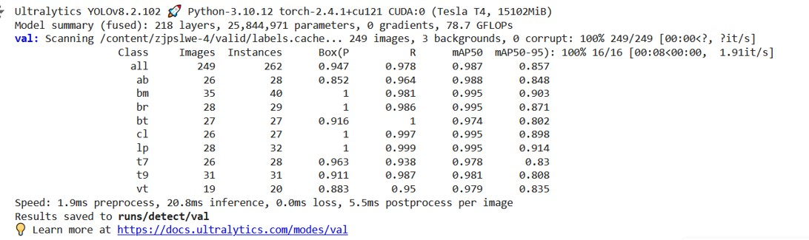

# Friend or Foe Identification System


## Motivation

Friendly fire remains a significant issue on modern battlefields. According to an [article](https://www.usni.org/magazines/proceedings/1994/june/friendly-fire-facts-myths-and-misperceptions) by the US Naval Institute, this problem persists despite many implemented solutions. This project explores the potential of a computer vision-assisted solution to reduce the incidence of friendly fire.

This application is designed for defense use, providing a **Friend or Foe (FoF) Identification System** for military vehicles. It identifies and classifies detected vehicles as friendly or enemy units using computer vision. The system uses a YOLO v8 model trained on a dataset gathered and annotated using data available on the internet and the Roboflow platform.

## Features

### Vehicle Identification and Classification
The system is trained to identify the following vehicles and their types:

- **Tanks**:
  - M1 Abrams
  - Challenger
  - Leopard 2
  - T-72
  - T-90
- **Infantry Fighting Vehicles (IFVs)**:
  - M2 Bradley
  - BMP-2
- **Armored Personnel Carriers (APCs)**:
  - M113
  - BTR (mostly BTR-80 and BTR-82)

### Friend or Foe Classification
The system compares identified vehicles against two pre-defined lists of friendly and enemy units to determine whether the vehicle is a friend or a foe. The result is displayed above the detected object using OpenCV.

### Dataset

- **Size**: 1,540 images
- **Augmentation**: Dataset extended using data augmentation techniques available on Roboflow to increase robustness.
- **Diversity**: The dataset includes images of vehicles from various angles, under different weather conditions, terrains, and visibility constraints, such as camouflage, dust, and varying distances.

### Real-Time Potential
Although not currently implemented, the system has the potential for real-time identification and classification.

## Setup and Running the Application

### Dependencies
Install the necessary dependencies from the `requirements.txt` file using:

```bash
pip install -r requirements.txt
```

### Dataset

- **Size**: 1,540 images
- **Augmentation**: Dataset extended using data augmentation techniques available on Roboflow to increase robustness.
- **Diversity**: The dataset includes images of vehicles from various angles, under different weather conditions, terrains, and visibility constraints, such as camouflage, dust, and varying distances.
- **Dataset link**: [https://universe.roboflow.com/master-srj7j/zjpslwe/dataset/4](https://universe.roboflow.com/master-srj7j/zjpslwe/dataset/4)
- **Classes abbreviations**:
  - `ab`: M1 Abrams
  - `cl`: Challenger
  - `lp`: Leopard
  - `t7`: T-72
  - `t9`: T-90
  - `bm`: BMP-2
  - `br`: M2 Bradley
  - `bt`: BTR
  - `vt`: M113

### Training Performance


### Running the Application

The application can be run using:

```bash
python ffi.py
```

### Model Weights

The pre-trained YOLO v8 model weights (`best.pt` and `last.pt`) are provided in the repository.

### How it Works

1. **Detection**: The YOLO v8 model detects vehicles in the video frames and extracts bounding box information for each detected vehicle.
2. **Classification**: The system then matches the detected vehicle against the pre-defined lists of friendly (**Team_1**) and enemy (**Team_2**) units.
3. **Display**: The classification result (**Friend** or **Enemy**) and the vehicle type are displayed above the detected object on each frame of the video.

### Areas of Improvement

- **Identifying Similar Vehicles**: In real scenarios, both friendly and enemy forces might use the same vehicle models. To address this, an additional classifier trained specifically on camouflage patterns could be used to differentiate between friend and foe.

- **Handling Unseen Vehicle Types**: The current model cannot identify new vehicle types that it hasn't been trained on. Implementing an anomaly detection system could help detect such unseen types and classify them as "Unknown" or pass them through further classifiers based on additional criteria like camouflage.
